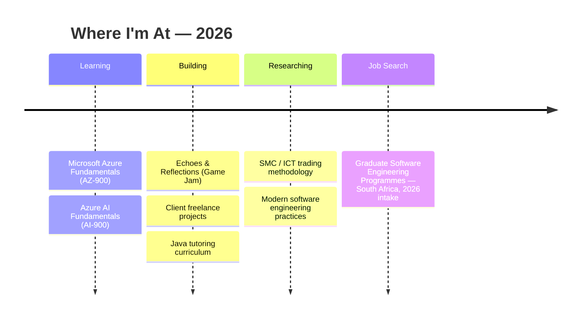

<div align="center">


<a href="https://github.com/HusainMamoojee">
  
</a>

<br/>


<br/><br/>

<a href="https://www.linkedin.com/in/husain-mamoojee/">
  
</a>
<a href="https://github.com/HusainMamoojee">
  
</a>
<a href="mailto:mamooghusain@gmail.com">
  
</a>
<a href="#">
  
</a>

<br/><br/>


</div>

<br/>

## 🧑‍💻 About Me

<table width="100%">
<tr>
<td width="100%" style="background-color:#0F172A;">

```
const husain = {
    role: "Final-Year BSc Software Engineering Student @ Eduvos",
    location: "Johannesburg, South Africa",
    focus: ["Full-Stack Development", "AI & Emerging Tech", "Mobile Apps", "Cloud", "Automation"],
    currentlyLearning: ["Microsoft Azure Fundamentals (AZ-900)", "Azure AI Fundamentals (AI-900)"],
    activePursuit: "Software Engineering Graduate Programmes — South Africa 2026",
    philosophy: "Curiosity-driven, problem-first, ship real things that people use."
};
```

</td>
</tr>
</table>

- 🎓 Final-year **BSc Software Engineering** student at Eduvos, graduating **November 2026**
- 🏆 Recipient of the highly competitive **PwC Static JSYC Bursary**
- 🚀 Built and shipped commercial platforms, hackathon-winning apps, and independent projects — from concept to production
- 🤖 Deep interest in **AI/ML integration, NLP, and CV-matching systems**
- 📱 Comfortable across the stack — web, mobile (iOS/Swift), backend, and cloud fundamentals
- 👨‍🏫 Runs a structured **freelance Java tutoring practice** alongside client web development work
- 🥋 Off-screen: trains Muay Thai and studies algorithmic/SMC trading methodology
- 💬 Actively interviewing for **graduate software engineering programmes** across South Africa

<br/>

## 🛠️ Tech Stack

<div align="center">

**Languages**


**Frontend**


**Backend**


**Mobile**


**Databases**


**Cloud & DevOps**


**AI & Tools**


</div>

<br/>

## 📊 GitHub Statistics

<div align="center">


<br/>


<br/>


<br/><br/>


</div>

<br/>

## 🚀 Featured Projects

<table width="100%">
<tr>
<td width="50%" valign="top">

### 🎯 OpportunityMap SA
**AI-Assisted Graduate Opportunity Platform**

An AI-powered platform that aggregates internships, learnerships, bursaries, and graduate roles from multiple sources, using web scraping, NLP, and CV-matching to connect graduates with relevant opportunities.

`React` `AI/NLP` `Web Scraping` `Vercel`

<a href="https://github.com/HusainMamoojee">

</a>


</td>
<td width="50%" valign="top">

### 📚 VossieXchange
**Peer-to-Peer Textbook Marketplace**

A live C2C marketplace deployed across all 12 Eduvos campuses, helping students resell textbooks affordably — built end-to-end with payment integration, role-based access, admin analytics, and in-app messaging.

`PHP` `MySQL` `PayFast` `RBAC`

<a href="https://github.com/HusainMamoojee">

</a>


</td>
</tr>

<tr>
<td width="50%" valign="top">

### 📈 JSE Trading System
**Algorithmic Signal Engine & Backtester**

A trading analysis platform generating live signals from market data, with a full backtesting engine and a CustomTkinter dashboard for performance reporting — used to support real investment decisions during a JSE trading competition.

`Python` `Streamlit` `CustomTkinter`

<a href="https://github.com/HusainMamoojee">

</a>

</td>
<td width="50%" valign="top">

### 🎮 Echoes & Reflections
**Browser-Based Game — Campus Game Jam 2026**

A mirror-duel / puzzle concept exploring a player-and-echo dual-character mechanic, prototyped across Three.js and Godot 4 for a competitive game jam entry.

`Three.js` `Godot 4` `Game Design`

<a href="https://github.com/HusainMamoojee">

</a>

</td>
</tr>

<tr>
<td width="50%" valign="top">

### 🧠 Sisa — Mental Health Platform
**MTN App of the Year Hackathon — Best Solution**

A virtual mental health support platform built during COVID-19 to improve access to remote support and therapy services — recognised with Best Solution from 218 hackathon entries.

`Hackathon` `Mobile` `Healthtech`


</td>
<td width="50%" valign="top">

### 👗 Aura
**AI-Powered Wardrobe & Outfit Matching App**

A Flutter/FastAPI app using CLIP embeddings to power aesthetic outfit matching, with a self-built backend on Postgres — developed hands-on to deeply understand every layer of the system.

`Flutter` `FastAPI` `Postgres` `CLIP`

<a href="https://github.com/HusainMamoojee">

</a>

</td>
</tr>
</table>

<br/>

## 🧭 Current Focus



<br/>

## 🏆 Achievements

<table width="100%">
<tr>
<td align="center" width="33%">

**🎓 PwC Static JSYC Bursary**
<br/>
<sub>Awarded for academic performance & problem-solving ability</sub>

</td>
<td align="center" width="33%">

**🥇 MTN App of the Year — Best Solution**
<br/>
<sub>Recognised from 218 hackathon entries</sub>

</td>
<td align="center" width="33%">

**🚕 Mpilotech Techathon — MVP Presentation**
<br/>
<sub>Taxi GPS application presented live to judges</sub>

</td>
</tr>
</table>

<br/>

## ⚡ Fun Facts

- 🥋 Currently rehabilitating and returning to full **Muay Thai** training after a collarbone injury
- 📈 Studies **XAU/USD** price action using SMC/ICT methodology, and builds algorithmic tools to test it
- 🧩 Went from a **Three.js arena survival game** to a **1v1 mirror-duel fighter** to a **Godot puzzle prototype** in the same game jam
- ☕ Believes in writing every line of code himself — Claude explains the concepts, he does the typing
- 🏪 Runs a small bootstrapped toy-reselling side business alongside his studies

<br/>

## 🤝 Connect With Me

<div align="center">

<a href="https://www.linkedin.com/in/husain-mamoojee/">

</a>
<a href="mailto:mamooghusain@gmail.com">

</a>
<a href="https://github.com/HusainMamoojee">

</a>

</div>

<br/>

<div align="center">


</div>
